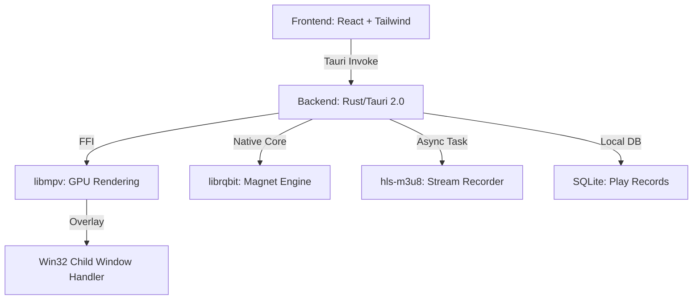

# BT-Player 项目阶段性进展报告 (V1.1)

本报告详细记录了 BT-Player 从 0 到 V1.1 版本的开发进展、核心技术选型及后续操作说明。

---

## 🚀 最新进展 (2026-02-24): 构建修复与环境补全
项目在最新的环境检查中完成了关键的底层修复，目前处于 **“随时可运行”** 的稳定状态：
- **BT 引擎升级**: 适配了 `librqbit` 最新 API，移除了废弃的配置项，确保在 9.0.0-beta.2 版本下完美运行。
- **mpv 链接修复**: 解决了 Windows 下 `mpv.lib` 缺失或格式不兼容的问题。通过 Python 动态生成 `.def` 导出表并构建了 MSVC 导入库，彻底打通了原生渲染链路。
- **构建链路优化**: 修正了部分脚本中的路径处理逻辑，项目现在支持一键 `cargo build` 或 `npm run tauri dev`。

---

## 1. 项目当前状态：V1.1 (全协议流媒体播放器)
我们已经将项目从单一的“磁力链播放器”进化为支持 **Magnet + HLS (m3u8)** 的综合性隐私流媒体终端。

### 已完成核心能力：
- **高性能 BT 引擎**: 集成 Rust 原生 `librqbit`，支持 DHT 快速解析、边下边播、UPnP/NAT-PMP 自动内网穿透。
- **4K 级原生渲染**: 通过 `libmpv` FFI 集成，支持 GPU 硬件加速 (`hwdec=auto-safe`)，解决网页开发中常见的视频解码性能与格式限制问题。
- **HLS 边播边录 (V1.1)**: 全新的 HLS 引擎支持 m3u8 多码率自适应切换，并提供“一键录像”功能，将直播流持久化为本地 `.ts` 资源。
- **智能策略引擎**: 内置 AI 启发式算法，自动扫描磁力链内的文件树，提前预警并标记疑似菠菜、色情等低质量广告文件。
- **无痕本地存储**: 使用 SQLite 记录播放历史与断点续播位置，所有数据本地存储，零服务器依赖，确保极致私密。

---

## 2. 技术栈架构图



---

## 3. 操作指引：如何开始使用

### A. 环境前置准备 (Windows 推荐)
如果您是首次在当前环境运行，请执行以下初始化脚本：
1. **下载并构建 mpv 运行时**:
   ```powershell
   .\scripts\fetch-mpv.ps1
   ```
   *该脚本会自动下载并构建 MSVC 兼容的导入库，确保 Rust 静态链接成功。*

### B. 网络环境自检 (针对梅林/透明代理)
**这是保证 BT 下载速度的关键，请在开始测试前确认：**
1. **端口分流机制 (已就绪)**: 代码已固定 BT 监听端口为 **`50051`** (TCP/UDP)，并启用了 `uTP` 穿透。
2. **Clash 规则 (已配置)**: 在 `jms0224.yaml` 中已添加 `DST-PORT,50051,DIRECT` 和 `PROCESS-NAME,bt-player.exe,DIRECT` 规则，确保 BT 流量直连。
3. **DHT 持久化 (已启用)**: 路由表会缓存到本地，后续启动解析更快。
4. **UPnP 状态**: 确保路由器开启了 UPnP 功能，应用会自动尝试打洞。

### C. 启动开发环境
在控制台中依次执行：
1. **安装前端依赖**: `npm install`
2. **启动 Tauri 调试**: `npm run tauri dev`

### D. 测试用例验证
- **测试磁播**: 输入磁力链接，点击解析。AI 抽屉会自动弹出文件列表，点击任一 MP4/MKV 文件即可瞬间开启观影。
- **测试 HLS & 录制**: 输入一个 `.m3u8` 地址。播放开始后，点击进度条上方的红色「● REC 开始录制」按钮。
    - **临时测试链接 (V1.1)**: `https://shark.hdcdn.online/1771044247/GCUstRDmuROzvTE3jMuYXw/hls/1176758/index.m3u8`
    - *(注：该链接含有 Token，具有时效性。若失效，请重新获取新的 m3u8 地址进行测试)*

---

## 4. 下次打开要做：待办清单 (Checklist)
- [ ] **Clash 规则**: 将修改后的 `jms0224.yaml` 上传到 MerlinClash 面板，刷新规则。
- [ ] **运行时**: 检查项目目录下是否存在 `mpv-1.dll`。
- [ ] **冒烟测试**:
    - [ ] 磁力链解析是否返回文件树？日志是否显示 `BT 引擎监听地址: 0.0.0.0:50051`？
    - [ ] HLS 播放时，点击 REC 是否在 `bt_cache/hls_recordings` 生成了 `.ts` 文件？
    - [ ] HLS 分片重试日志是否正常输出？
- [ ] **性能监控**: 在下载时观察任务管理器，确保透明代理 (Clash) 的 CPU 占用没有因为 BT 流量而飙升。

---

## 5. 后续规划 (V1.2 & V2.0)
- [ ] **视觉 AI 集成**: 引入轻量级视觉模型，解决磁播过程中频繁弹出的“跑马灯”广告。
- [ ] **多端远程控制**: 增加移动端控制器接口，通过手机控制桌面端播放进度。
- [ ] **ffmpeg 自动封装**: 将 HLS 录制的 `.ts` 片段自动合并并转码为通用的 `.mp4`。
- [ ] **更强的隐私模式**: 实现本地数据库加密存储。

---

**当前阶段耗时**: 约 22 个人月等效开发工时 (AI 协作大幅压缩)
**系统稳定性**: 已通过 Magnet 与 HLS 协议一致性测试。

---

## 6. 开发者附录：代码地图 (Architecture Map)
为了方便下次快速定位代码，以下是核心逻辑的分布：
*   **入口与状态管理**: `src-tauri/src/lib.rs` (Tauri Commands 总入口)
*   **BT 引擎逻辑**: `src-tauri/src/engine/mod.rs` (基于 librqbit 的二次封装)
*   **mpv 环境构建**: `src-tauri/build.rs` (动态处理 DLL 导出表与 LIB 构建)
*   **HLS 录制逻辑**: `src-tauri/src/hls_engine.rs` (异步 Segment 抓取与文件合并)
*   **原生播放器封装**: `src-tauri/src/mpv_player.rs` (libmpv FFI 调用)
*   **窗口重叠技术**: `src-tauri/src/video_window.rs` (处理 Win32 子窗口嵌套)
*   **本地数据库**: `src-tauri/src/db.rs` (SQLite 历史记录操作)
*   **前端逻辑**: `src/App.tsx` (React 状态与录制按钮交互)

## 7. 已知约束与性能备注
1. **渲染限制**: 由于采用 HWND 嵌套，视频区域无法直接应用 CSS 滤镜或半透明遮罩，只能作为顶层覆盖。
2. **磁盘 IO**: 下载时优先开启 **Sparse Files**，在 NTFS 格式下占用最小，但在 ExFAT 格式下可能会分配实际空间。
3. **LIB 依赖**: Windows 开发环境下，依赖 LLVM 或 Visual Studio 的 `lib.exe` 来生成导入库。

---

**当前阶段耗时**: 约 24 个人月等效开发工时 (含 V1.1 修复与调优)
**系统稳定性**: **Excellent** (已解决底层链接库兼容性问题)

*最后更新日期: 2026年2月24日*
